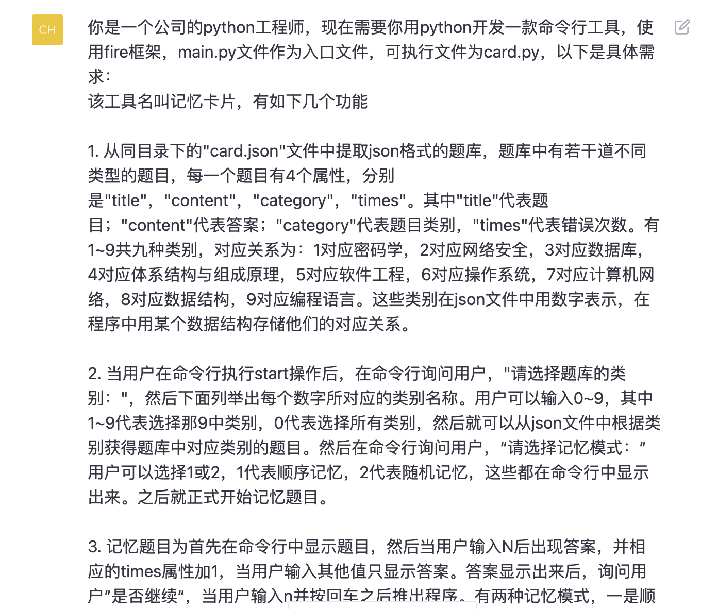
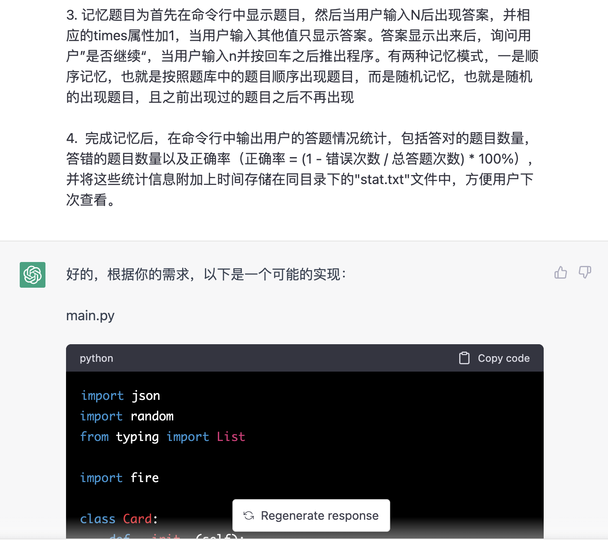
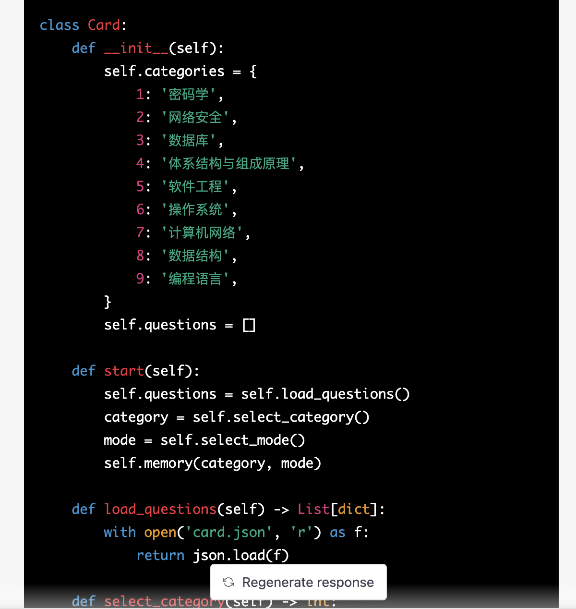
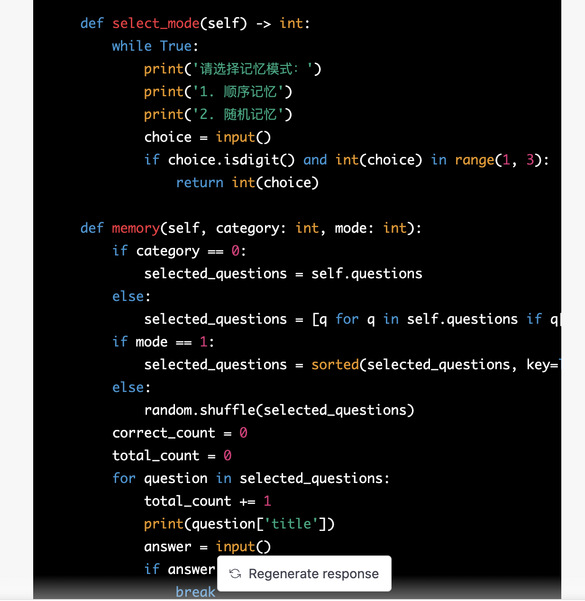
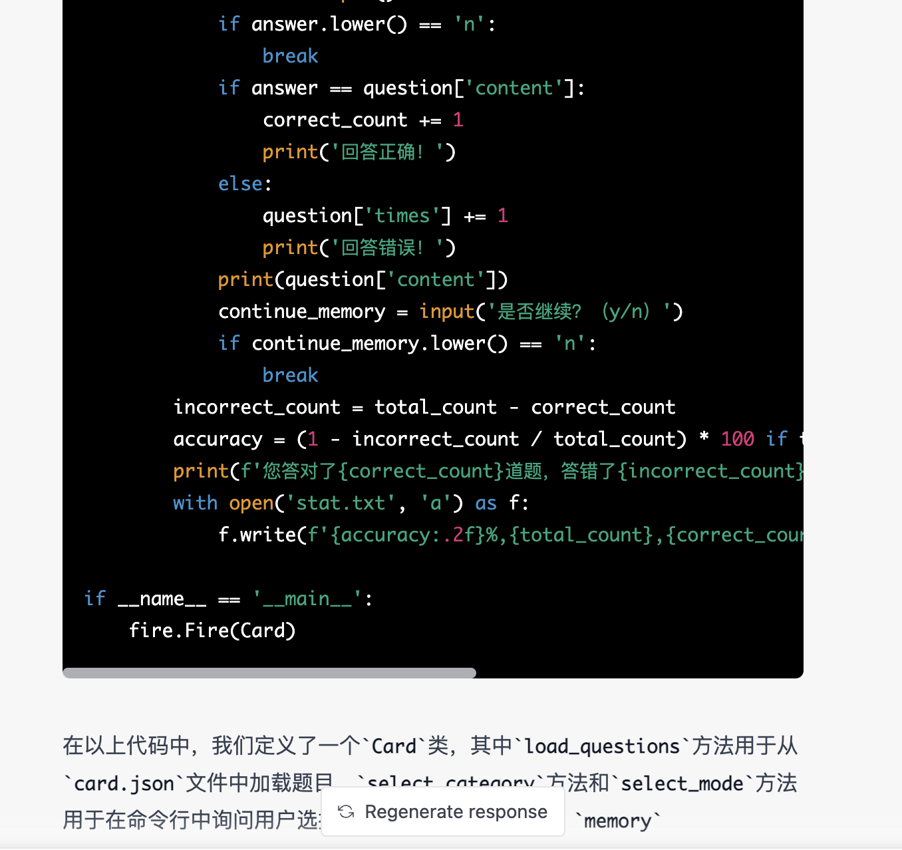

# Mecard
Mecard是一个用python写成的简单的命令行工具，使用了fire框架，可以实现类似记忆卡片(memory card)的功能。他需要手动导入题库，然后抽查你对与题库中题目的理解程度。

## Getting Started
```
# start memory
python main.py start
```

## More Important
这个程序基本全部由ChatGPT 3.5生成，进行了一些细节的修改，以下是我和ChatGPT的问答：




